---

## 2017-10-06

---

## 2017-09-28

### TO DO:

- Lipreader, Critic analysis
  - [Towards Transparent Systems: Semantic Characterization of Failure Modes - Aayush Bansal, Ali Farhadi, Devi Parekh, ECCV 2014](http://www.cs.cmu.edu/~aayushb/pubs/characterizing_mistakes_eccv2014.pdf)
  - [Predicting Failures of Vision Systems - ..., Devi Parekh, CVPR 2014](https://www.cc.gatech.edu/~parikh/Publications/predicting_failures_CVPR2014.pdf)
  - [Diagnosing Error in Object Detectors - Derek Hoiem et al, ECCV 2012](http://dhoiem.cs.illinois.edu/publications/eccv2012_detanalysis_derek.pdf)
  - Failures of Gradient-Based Deep Learnin - Shai Shalev-Shwartz et al. - [MLR](http://proceedings.mlr.press/v70/shalev-shwartz17a/shalev-shwartz17a.pdf), [arXiv](https://arxiv.org/pdf/1703.07950.pdf)

- Zero Shot Learning formalization

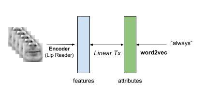

### APPLICATIONS

- Use a critic to pin point top out of top-5

- Train with GridCorpus, fine tune with Obama using Critic/Assessor and get better accuracy!

- Classical unsupervised domain adaptation - to find out distribution 

- Self-training (Learner to improve learning over time)

- Use cases - assistive, closed captions, security

---

## 2017-09-16

### Self-Learning on GRIDcorpus

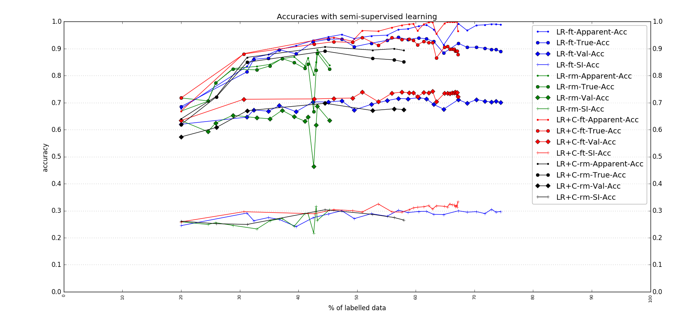

Figure 1: Comparison of Apparent accuracy, True accuracy, Val accuracy, Speaker-independent accuracy among training with:

- <blue> only lipreader at 99% confidence, with finetuning (and not remodelling)

- <green> only lipreader at 99% confidence, with remodelling

- <red> lipreader at 95% confidence + critic at 10% confidence, with finetuning (and not remodelling)

- <black> lipreader at 95% confidence + critic at 10% confidence, with finetuning (and not remodelling)

#### CONCLUSION

- LR + Critic works marginally better/faster

- Finetuning works better/faster than remodelling

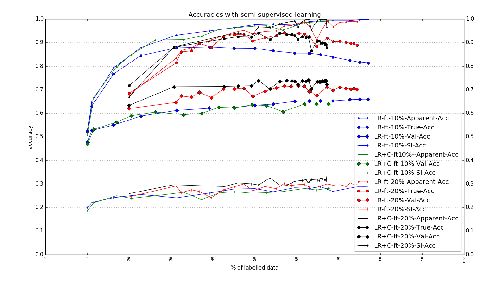

Figure 2: Comparison of Apparent accuracy, True accuracy, Val accuracy, Speaker-independent accuracy among training with:

- <blue> starting at 10% of training data, only lipreader, at 95% confidence, with finetuning

- <green> starting at 10% of training data, lipreader at 95% confidence + critic at 10% confidence, with finetuning

- <red> starting at 20% of training data, only lipreader, at 99% confidence, with finetuning

- <black> starting at 20% of training data, lipreader at 95% confidence + critic at 10% confidence, with finetuning

---

## 2017-09-02

### Lip Reader

- Lip Reader with Masking and Reverse-Sequence of frames input to LSTM: Train - 92%, Val - 85%, SI - 24%

### Critic

- Critic - taking only video input and a predicted word

- Training with top-3 predicted words from best lip reader

- Accuracies: Train - 64.4%, Val - 64.5%, SI - 66.7%

- ROC curve and Precision-Recall curve:

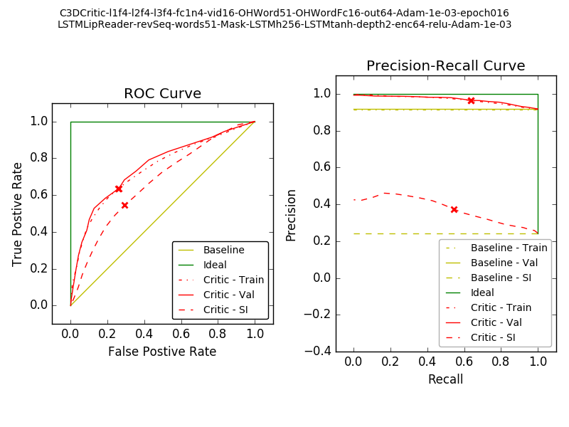

Figure 1: ROC curve and precision-recall curve for one set of weights of critic (at epoch number 16). The 'X' marks are at the values for threshold=0.5.

- Accuracies vs Threshold:

Figure 2: Accuracy of Critic with different values of threshold over the critic's scores.

### Combining Critic and LipReader

- Take Top-5 predictions of lipreader, find out critic's scores for them, multiply with lipreader's scores, find accuracy of lipreader (No. of correct predictions/total)

- On a very good lipreader (above - epoch 79):

    - Train: Only LipReader - 91.51%, LipReader*Critic - 91.49%

    - Val: Only LipReader - 91.8%, only critic - 50.6%, LipReader*Critic - 91.4%

    - SI: Only LipReader - 24.3%, only critic - 20.5%, LipReader*Critic - 25.5%

- On an average lipreader (epoch 35):

    - Train: Only LipReader - 82.5%, only critic - 46.7%, LipReader*Critic - 81.3%

    - Val: Only LipReader - 82.9%, only critic - 46.5%, LipReader*Critic - 81.4%

    - SI: Only LipReader - 22.6%, only critic - 19.7%, LipReader*Critic - 23.9%

- On a very bad lipreader (epoch 0):

    - Train: Only LipReader - 13.4%, only critic - 22.8%, LipReader*Critic - 24.7%

    - Val: Only LipReader - 13.7%, only critic - 22.2%, LipReader*Critic - 24.3%

    - SI: Only LipReader - 9.7%, only critic - 13.3%, LipReader*Critic - 15.2%

- CONCLUSION - critic doesn't offer much when the LR is awesome, but when the LR is bad the critic can improve accuracy

## EXPERIMENTAL RESULTS

### Lip Reader

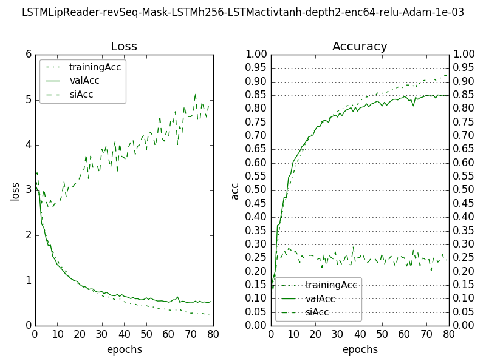

Figure 1: Loss and accuracy for training data, validation data and speaker-independent data, for Lip Reader using LSTM, with Masking at input and reverse sequence of frame input

### Critic

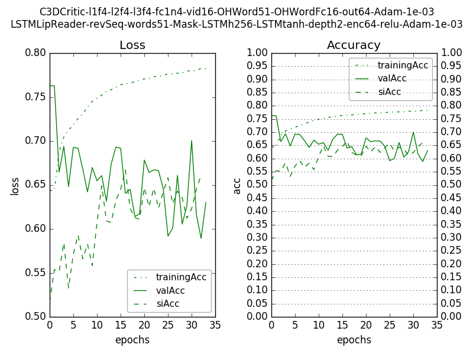

Figure 2: Loss and accuracy for training data, validation data and speaker-independent data, for Critic taking only video sequence and predicted word as input. Training data consisted of video input and top-3 predicted words by lipreader.

- I chose the weights at epoch 16 (val and speaker-independent loss almost equal).

## DISCUSSION

- Baseline Accuracy vs Threshold from softmax scores of LR

- Only use critic in a region - when LR is dicey. If LR is very sure, ignore critic.

- Additional information to Critic - fraction of scaling up or down the mouth image

- Use case: self-learning?

- Use LR*Critic on very few data

- Train fusion

---

## 2017-08-26

- Changed output to only softmax of words vocabulary
    - Accuracy is now calculated as word-accuracy

- Accuracies in paper: [LIPREADING WITH LONG SHORT-TERM MEMORY](https://arxiv.org/pdf/1601.08188.pdf):
    - Speaker-dependent accuracy - 79.4%; Speaker-independent accuracy - 79.6%

- Using LipReader "LSTM-noPadResults-h256-depth2-LSTMactivtanh-enc64-encodedActivsigmoid-Adam-1e-03-GRIDcorpus-s0107-s0909-tMouth-vMouth-NOmeanSub-epoch078-tl0.4438-ta0.8596-vl0.6344-va0.8103-sil3.2989-sia0.3186.hdf5"
    - Speaker-dependent: Training accuracy - 86%, Validation accuracy - 81%; Speaker-independent accuracy - 32%

- Using Critic "C3DCritic-LRnoPadResults-l1f8-l2f16-l3f32-fc1n64-vid64-enc64-oneHotWord52-out64-Adam-5e-04-GRIDcorpus-s0107-s0909-tMouth-vMouth-NOmeanSub-epoch002-tl0.2837-ta0.8783-vl0.4017-va0.8255-sil1.4835-sia0.3520.hdf5"
    - Without taking critic into account, trainAccuracy = 87%, valAccuracy = 81%, speakerIndependentAccuracy = 32%
    - Only considering those critic said right, trainAccuracy - 89% , valAccuracy - 83% , speakerIndependentAccuracy - 32.5%
    - Among those critic said wrong, % actually wrong: train 54% , val 68% , speakerIndependent 89%

        -Train: tP=36119, fP=837, fN=4309, tN=975

                        Critic | Actually True | Actually False
                        ---------------------- | ------------- | -------------
                        Critic predicted True |     36119     | 837
                        Critic predicted False |     4309      | 975

        - Val: tP=3676, fP=61, fN=743, tN=128

                        Critic | Actually True | Actually False
        ---------------------- | ------------- | -------------
         Critic predicted True |      3676     | 61
        Critic predicted False |      743      | 128

        - Speaker-independent: tP=13306, fP=150, fN=27587, tN=1197

                        Critic | Actually True | Actually False
        ---------------------- | ------------- | -------------
         Critic predicted True |     13306     | 150
        Critic predicted False |     27587     | 1197

### LipReader training

Figure 1a. Training, validation, and speaker-independent word-accuracies of lipReader while training

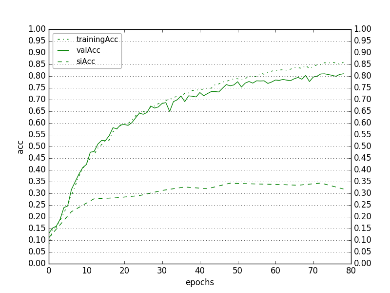

Figure 1b. Training, validation, and speaker-independent losses of lipReader while training

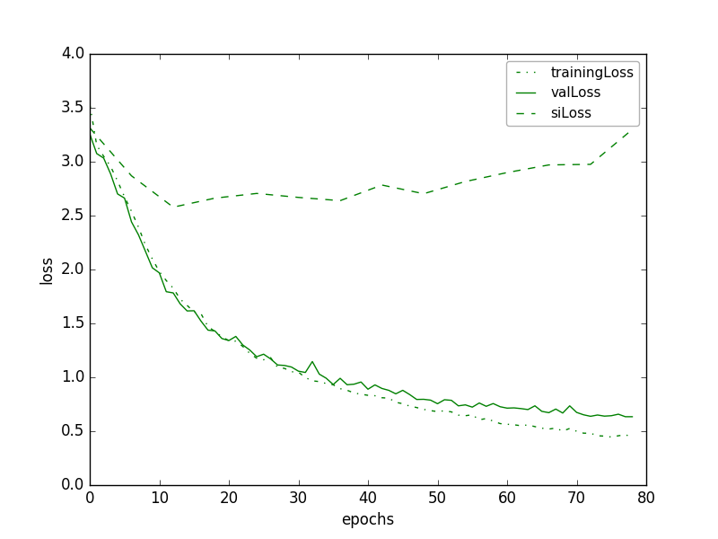

### Critic Training

Figure 2a. Training, validation, and speaker-independent accuracies of critic while training

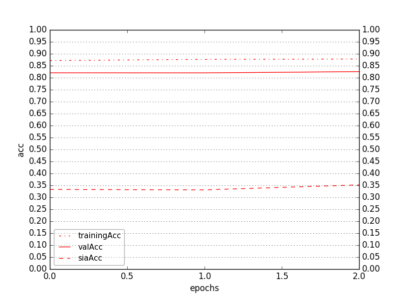

Figure 2b. Training, validation, and speaker-independent losses of critic while training

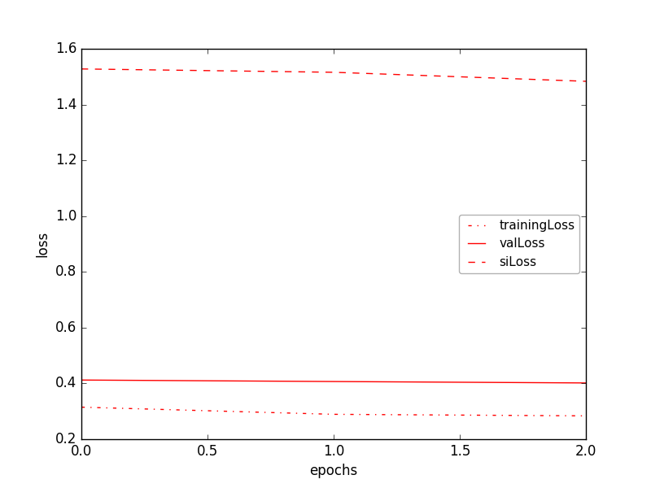

### Discussion

- [Improving Speaker-Independent Lipreading with Domain-Adversarial Training - IDSIA](https://arxiv.org/pdf/1708.01565.pdf)
    - Baseline accuracies correspond with our current results

- What can the assessor do?

- Motivation for Assessor/Critic:
    - What makes the critic better than the lipReader itself?
    - Eg. If Critic has access to Natural Language Model, THAT will help it perform better than the lipReader

- Reject class in deep learning

- Speech recognition vs Lip Reading - where does lip reading supercede speech recognition? What does a "noisy" environment mean?

---

## 2017-08-24

- Realized output having padding gives awesome accuracies but does not reflect actual word-classification accuracy
    - Accuracies are for output with padding, so, cannot be trusted

- Accuracies in paper: [LIPREADING WITH LONG SHORT-TERM MEMORY](https://arxiv.org/pdf/1601.08188.pdf):
    - Speaker-dependent accuracy - 79.4%
    - Speaker-independent accuracy - 79.6%

- Using LipReader "LSTM-h256-depth2-LSTMactivtanh-enc64-encodedActivsigmoid-Adam-1e-03-GRIDcorpus-s0107-s0909-tMouth-vMouth-NOmeanSub-epoch099-tl0.3307-ta0.8417-vl0.3782-va0.8304.hdf5"
    - Speaker-dependent: Training accuracy - 84.17%, Validation accuracy - 83.04%
    - Speaker-independent accuracy - 73.86%

### Comparison of LSTMSeq2Seq, LSTMd2, LSTMd3, LSTMd2enc (with padding)

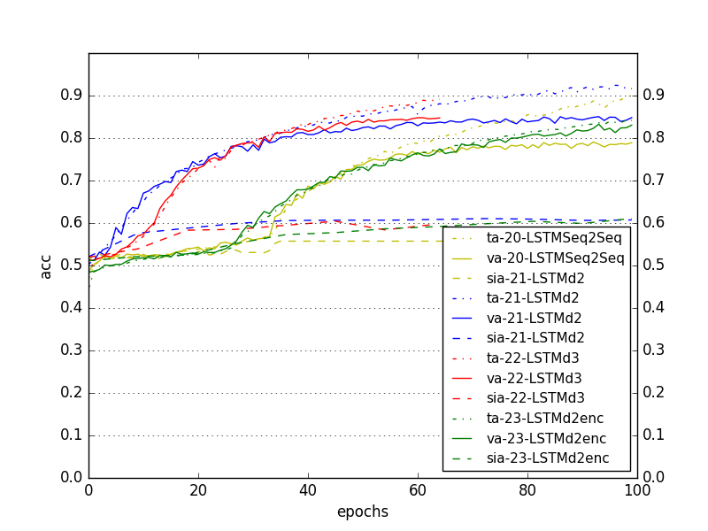

Figure 1a. Comparison of accuracies of LSTMSeq2Seq, LSTMd2, LSTMd3, LSTMd2enc (with padding in output)

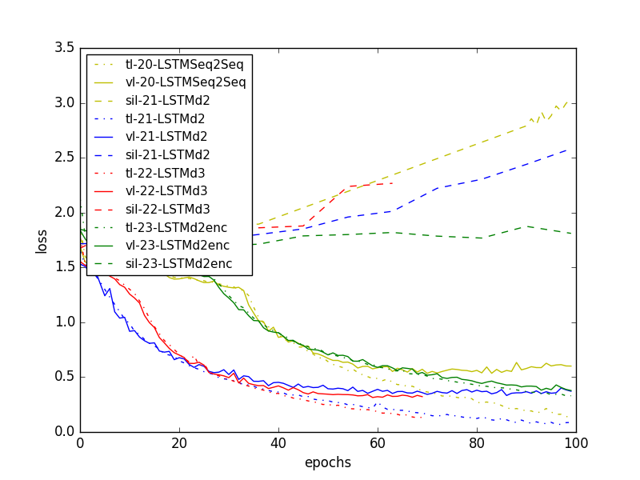

Figure 1b. Comparison of losses of LSTMSeq2Seq, LSTMd2, LSTMd3, LSTMd2enc (with padding in output)

### Comparison of different architectures (with padding)

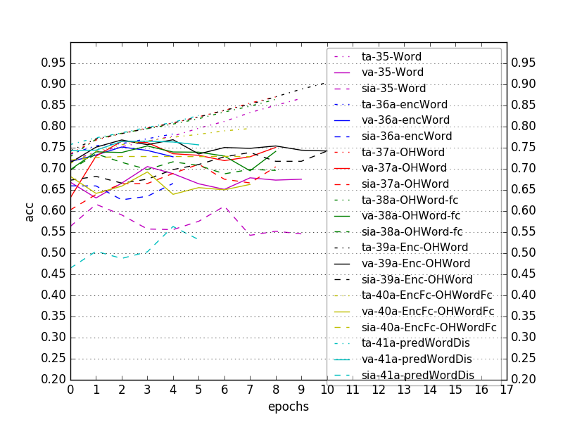

Figure 2a. Comparison of training, validation and speaker-independent accuracies for different architectures

Figure 2b. Comparison of training, validation and speaker-independent losses for different architectures

- It can be seen that Enc-OHWord is the best architecture overall

---

## 2017-08-19

- Accuracies in paper: [LIPREADING WITH LONG SHORT-TERM MEMORY](https://arxiv.org/pdf/1601.08188.pdf):
    - Speaker-dependent accuracy - 79.4%
    - Speaker-independent accuracy - 79.6%

- Using LipReader "LSTM-h256-depth2-LSTMactivtanh-enc64-encodedActivsigmoid-Adam-1e-03-GRIDcorpus-s0107-s0909-tMouth-vMouth-NOmeanSub-epoch099-tl0.3307-ta0.8417-vl0.3782-va0.8304.hdf5"
    - Speaker-dependent: Training accuracy - 84.17%, Validation accuracy - 83.04%
    - Speaker-independent accuracy - 62%

- Read [Has My Algorithm Succeeded?
An Evaluator for Human Pose Estimators](https://www.robots.ox.ac.uk/~vgg/publications/2012/Jammalamadaka12a/jammalamadaka12a.pdf) for reference on Evaluators/Critics/Assessors

### Comparing 1 or 2 word layers & 1 or 2 output layers

- As can be seen, it is better to have a layer right after inputting the encoded word from lipReader, before concatenating with video features

### Comparing enc, word, one-hot word, one-hot word + fc10, enc + one-hot word

- For this experiment, no negative samples were generated; only the predictions (positive or negative) from the LipReader were considered.

- Inputting one-hot encoded word is better than the word itself

- Inputting intermediate layer vector from LipReader + one-hot encoded predicted word seems to work the best

### Precision, Recall

- Considering the best LipReader and Critic (so far):
    - LSTMLipReaderModel.load_weights(os.path.join(saveDir, "LSTM-h256-depth2-LSTMactivtanh-enc64-encodedActivsigmoid-Adam-1e-03-GRIDcorpus-s0107-s0909-tMouth-vMouth-NOmeanSub-epoch099-tl0.3307-ta0.8417-vl0.3782-va0.8304.hdf5"))
    - criticModelWithWordFeatures.load_weights(os.path.join(saveDir, "C3DCritic-l1f8-l2f16-l3f32-fc1n64-vid64-enc64-oHn64-Adam-1e-04-GRIDcorpus-s0107-s0909-tMouth-vMouth-NOmeanSub-epoch007-tl0.3004-ta0.8631-vl0.4015-va0.8022.hdf5"))

- trainPrecision: Precision of the critic on the training data, i.e. among its results on the training data, in how many cases is the critic able to correctly tell if the output of the LipReader is correct or not

- totalTrainPrecision = 0.859839499319, meanTrainPrecision = 0.55379656487 (Better to take a weighted mean instead?)

- totalTrainRecall = 0.579317849492, meanTrainRecall = 0.334912278473

- totalValPrecision = 0.833484986351, meanValPrecision = 0.901960784314

- totalValRecall = 0.581402729292, meanValRecall = 0.980392156863

### Full Results

- trainPrecisionPerWord = [ 0.1538  0.9335  0.6378  0.3026  0.8336  0.8729  0.9042  0.6364  0.      0.
  0.7455  0.2857  0.8235  0.8687  0.4762  0.8826  0.2     0.      0.7377
  0.6939  0.4     0.      0.925   0.3846  0.      0.5912  0.9177  0.3684
  0.7807  0.1795  0.9336  0.9705  0.4286  0.      0.7869  0.      0.8554
  0.7605  0.8428  0.9759  0.1429  0.8437  0.7615  0.5625  0.4571  0.8529
  0.9452  0.      0.5573  0.1333  0.8973]

- meanTrainPrecision = 0.55379656487

- totalTrainPrecision = 0.859839499319

- trainRecallPerWord = [ 0.0139  0.6781  0.193   0.3382  0.7616  0.8589  0.5037  0.0642  0.      0.
  0.2087  0.0185  0.3986  0.3879  0.1064  0.8074  0.0641  0.      0.2961
  0.2636  0.0421  0.      0.6498  0.0347  0.      0.2287  0.5673  0.0534
  0.8695  0.4118  0.8336  0.7455  0.0517  0.      0.5675  0.      0.8085
  0.3759  0.3777  0.721   0.0213  0.5849  0.2115  0.0796  0.1046  0.8516
  0.5301  0.      0.6404  0.0889  0.6661]

- meanTrainRecall = 0.334912278473

- totalTrainRecall = 0.579317849492

- valPrecisionPerWord = [ 0.      0.9231  0.6667  0.0556  0.8209  0.8704  0.9121     nan  0.      0.
  0.8462     nan  0.7273  0.9032     nan  0.8358  0.      0.      0.8824
  0.5     0.1667  0.      0.875   0.25    0.      0.55    0.8879  0.3333
  0.7292  0.0909  0.8816  0.9621  0.      0.      0.7835     nan  0.8
  0.8333  0.7586  0.9708     nan  0.7959  0.75    0.3333  0.25    0.7871
  0.9759  0.      0.6154  0.    ]

- meanValPrecision = 0.901960784314

- totalValPrecision = 0.833484986351

- valRecallPerWord = [ 0.      0.6593  0.1692  0.25    0.7534  0.8443  0.5188  0.      0.
     nan  0.275   0.      0.3265  0.3836  0.      0.8235  0.      0.
  0.3629  0.1     0.1429  0.      0.6087  0.0385  0.      0.2292  0.5938
  0.0714  0.875   1.      0.8428  0.7744  0.      0.      0.6179  0.
  0.8333  0.5     0.3014  0.7348  0.      0.661   0.2045  0.1     0.1111
  0.8133  0.4821  0.      0.7273  0.    ]

- meanValRecall = 0.980392156863

- totalValRecall = 0.581402729292

---

## 2017-08-11

- Accuracies in paper: [LIPREADING WITH LONG SHORT-TERM MEMORY](https://arxiv.org/pdf/1601.08188.pdf):
    - Speaker-dependent accuracy - 79.4%
    - Speaker-independent accuracy - 79.6%

### COMPLETED

- Re-trained LSTM models (instead of SimpleSeq2Seq by farizrahman4u)

#### 1. LSTM MODELS

- Tried:
    - LSTM -> word prediction
        - depth = 2
        - depth = 3
    - LSTM -> encoding into (64) dimensions -> word prediction
    - LSTM -> encoding -> decoding via LSTM -> word prediction (similar to SimpleSeq2Seq)

- Reached up to 90% training accuracy, up to 85% validation accuracy, and 62% speaker-independent accuracy

#### 2. CRITIC

- Trained Critic using:
    1) predicted word,
    2) 64-dim encoded value

- Critic using predicted word from LSTMLipReader - each video was trained by giving as input:
    1) correct words,
    2) predicted words (80% accuracy),
    3) wrong words

- Critic using encoded value from LSTMLipReader - each video was trained by giving as input:
            1) predicted words (80% accuracy),
            2) wrong words

- Using encoded values instead of predicted words does seem to offer some advantage

#### 3. FINE-TUNING LipReader to HINDI

- Retained LSTM weights, replaced the last layer of LipReader models with Dense layers to match the Hindi vocabulary considered

- Tried with:
    1) LSTM -> word prediction,
    2) LSTM -> encoding into (64) dimensions -> word prediction

- Need to find out if graphs are good for progress

## EXPERIMENTS

### LSTM MODELS

#### 1. LSTM Model with hiddenDim=256, depth=2

- Speaker-dependent training accuracy - 91.61%, validation accuracy - 84.82%

- Speaker-independent validation accuracy - 61.73%

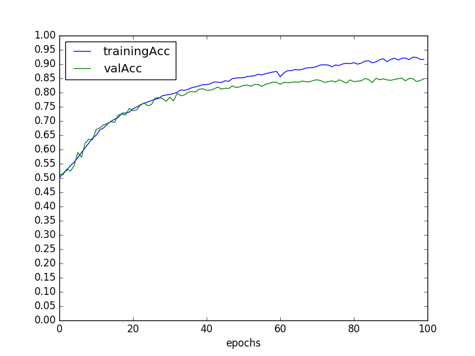

- Figure 1: Training accuracy, Validation accuracy vs Epoch, for model with LSTM of hiddenDim=256, depth=2

- Figure 2: Training loss, Validation loss vs Epoch, for model with LSTM of hiddenDim=256, depth=2

#### 2. LSTM Model with hiddenDim=256, depth=3

- Speaker-dependent training accuracy - 90.03%, validation accuracy - 84.85%

- Speaker-independent validation accuracy - 61.17%

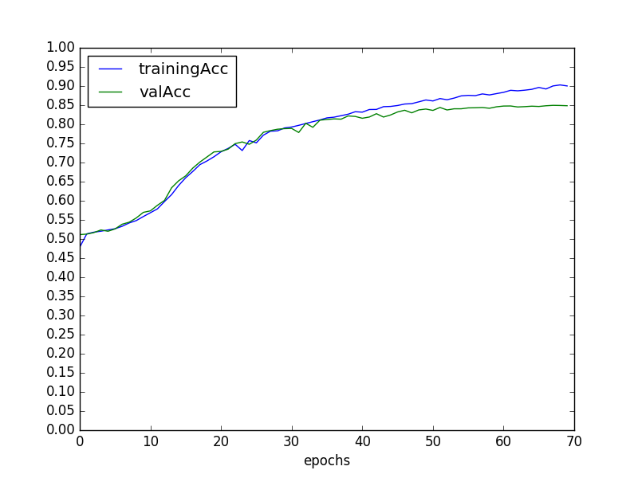

- Figure 3: Training accuracy, Validation accuracy vs Epoch, for model with LSTM of hiddenDim=256, depth=3

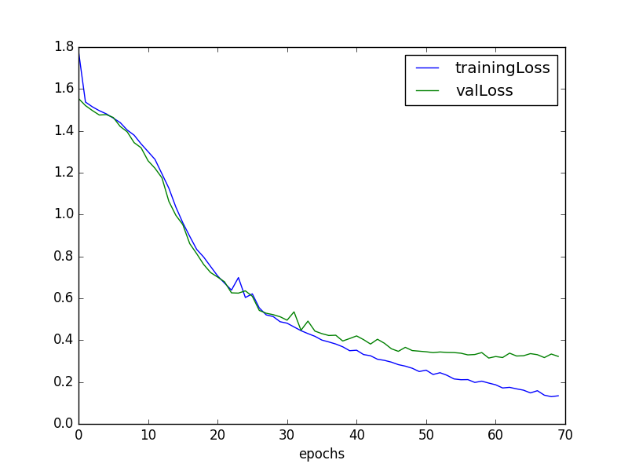

- Figure 4: Training loss, Validation loss vs Epoch, for model with LSTM of hiddenDim=256, depth=3

#### 3. LSTM Model with hiddenDim=256, depth=2, encoded into 64 dimensions*

- Speaker-dependent training accuracy - 84.17%, validation accuracy - 83.04%

- Speaker-independent validation accuracy - 62.02%

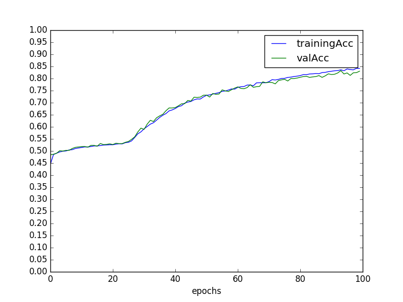

- Figure 5: Training accuracy, Validation accuracy vs Epoch, for model with LSTM of hiddenDim=256, depth=2, and an encoding Dense layer of dim=64

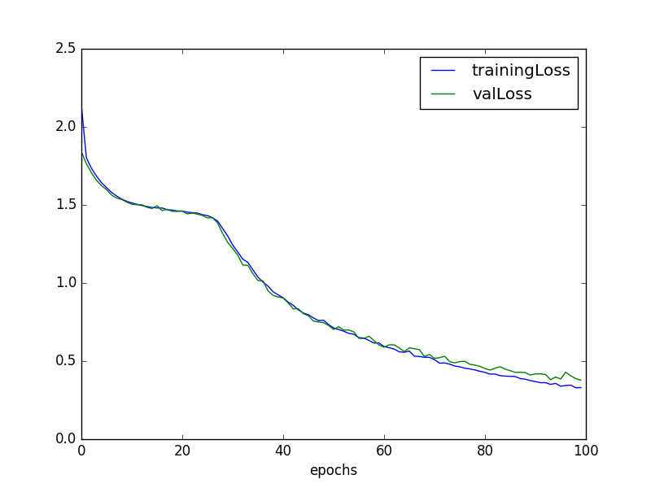

- Figure 6: Training loss, Validation loss vs Epoch, for model with LSTM of hiddenDim=256, depth=2, and an encoding Dense layer of dim=64

****Only ran for 100 epochs, can proceed further!!

#### 4. Seq2Seq LSTM Model with hiddenDim=256, depth=2 (Similar to what we were using before)

- Speaker-dependent training accuracy - 90.10%, validation accuracy - 78.90%

- Speaker-independent validation accuracy - 58.19%

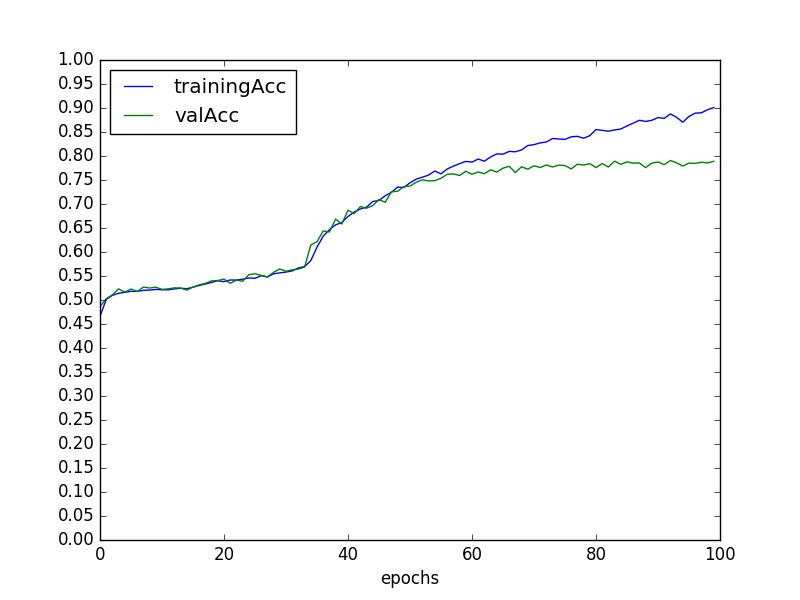

- Figure 7: Training accuracy, Validation accuracy vs Epoch, for model with Seq2Seq model of hiddenDim=256, depth=2

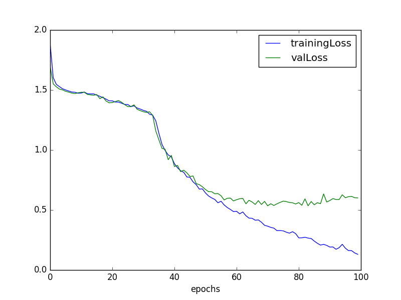

- Figure 8: Training loss, Validation loss vs Epoch, for model with Seq2Seq model of hiddenDim=256, depth=2

### CRITIC

#### 1. Critic using predicted word from LSTMLipReader

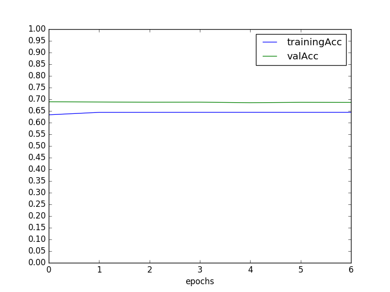

- Figure 9: Training accuracy, Validation accuracy vs Epoch, for Critic using predicted word from LSTMLipReader

- Figure 10: Training loss, Validation loss vs Epoch, for Critic using predicted word from LSTMLipReader

#### 2. Critic using 64-dimensional encoded value from LSTMLipReader

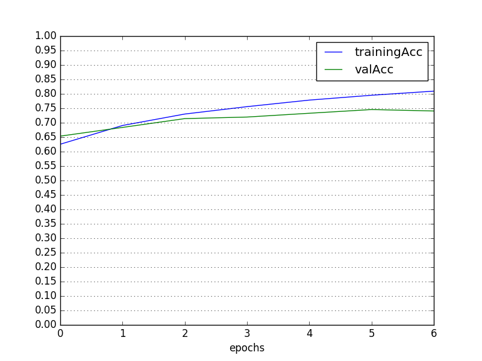

- Figure 11: Training accuracy, Validation accuracy vs Epoch, for Critic using 64-dimensional encoded value from LSTMLipReader

- Figure 12: Training loss, Validation loss vs Epoch, for Critic using 64-dimensional encoded value from LSTMLipReader

### FINE-TUNING - GRIDcorpus to HINDI

#### 1. Fine-tuning LSTM Model with hiddenDim=256, depth=3 to Hindi-LSTMLipReader

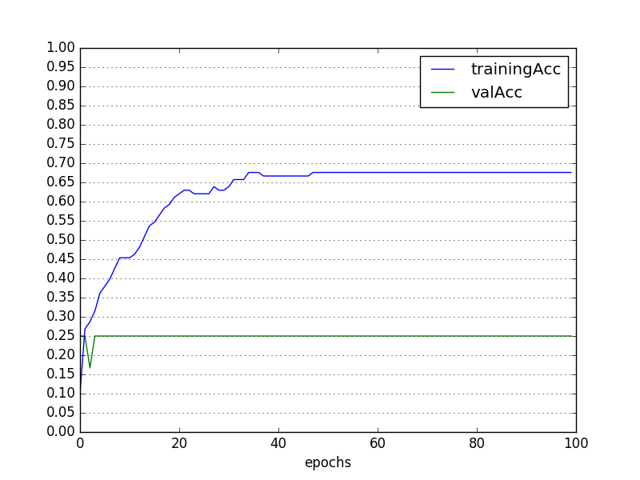

- Figure 13: Training accuracy, Validation accuracy vs Epoch, for LSTMLipReader with hiddenDim=256, depth=3 fine-tuned to Hindi-LSTMLipReader

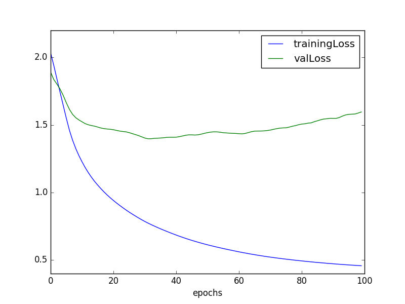

- Figure 14: Training loss, Validation loss vs Epoch, for LSTMLipReader with hiddenDim=256, depth=3 fine-tuned to Hindi-LSTMLipReader

#### 2. Fine-tuning LSTM Model with hiddenDim=256, depth=2, encoded into 64 dimensions to Hindi-LSTMLipReader

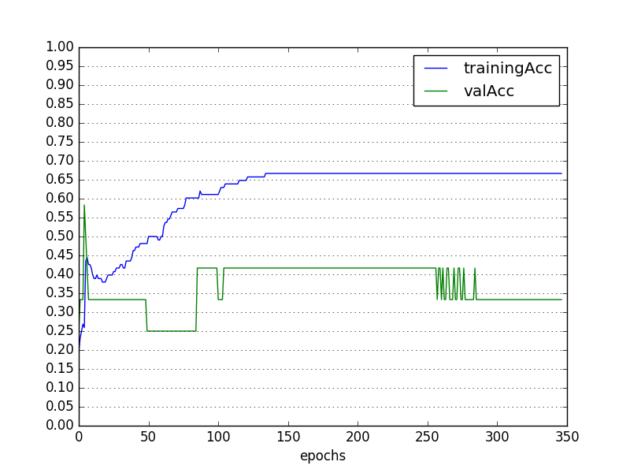

- Figure 15: Training accuracy, Validation accuracy vs Epoch, for LSTMLipReader with hiddenDim=256, depth=3 fine-tuned to Hindi-LSTMLipReader

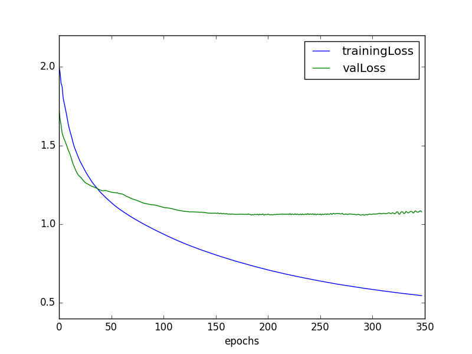

- Figure 16: Training loss, Validation loss vs Epoch, for LSTMLipReader with hiddenDim=256, depth=3 fine-tuned to Hindi-LSTMLipReader

### TO DO

- Applications of Critic: improving precision of lip reader, semi-supervised setting, to pin-point top out of top-5 predictions

- Read papers on critic-based methods
    - Dhanraj - Has my algorithm succeeded? ECCV 2012
    - Deric Hoyem - ICCV 2013

- Sanskrit phonemes for Indic language lip reading

---

## 2017-08-05

- Accuracies in paper: [LIPREADING WITH LONG SHORT-TERM MEMORY](https://arxiv.org/pdf/1601.08188.pdf):
    - Speaker-dependent accuracy - 79.4%
    - Speaker-independent accuracy - 79.6%

- For model trained by me, comparison of change in training and validation accuracies with epoch:

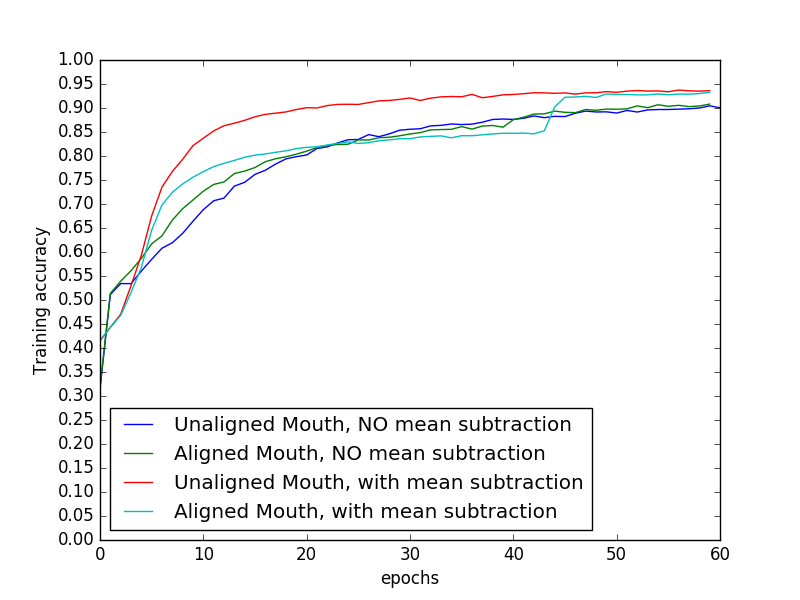

- Figure 1: Training accuracy vs Epoch, for models trained on a) unaligned faces, b) aligned faces, c) unaligned faces subtracted by mean image, d) aligned faces subtracted by mean image

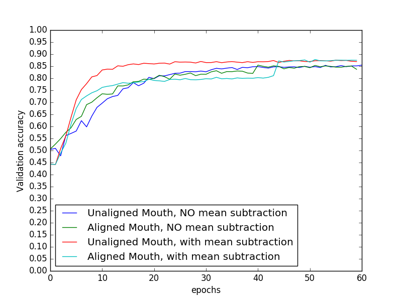

- Figure 2: Validation accuracy vs Epoch, for models trained on a) unaligned faces, b) aligned faces, c) unaligned faces subtracted by mean image, d) aligned faces subtracted by mean image

### Speaker-dependent validation accuracies

#### NO mean subtraction

- Trained with unaligned, validating on unaligned - 85.13%
- Trained with unaligned, validating on aligned - 83.43%
- Trained with aligned, validating on unaligned - 78.58%
- Trained with aligned, validating on aligned - 83.72%

#### With mean subtraction

- Trained with unaligned, validating on unaligned - 86.94%
- Trained with unaligned, validating on aligned - 84.65%
- Trained with aligned, validating on unaligned - 78.44%
- Trained with aligned, validating on aligned - 87.46%

### Speaker-independent validation accuracies

#### NO mean subtraction

- Trained with unaligned, validating on unaligned - 62.73%
- Trained with unaligned, validating on aligned - 65.22%
- Trained with aligned, validating on unaligned - 61.30%
- Trained with aligned, validating on aligned - 64.69%

#### With mean subtraction

- Trained with unaligned, validating on unaligned - 58.47%
- Trained with unaligned, validating on aligned - 60.24%
- Trained with aligned, validating on unaligned - 56.2%
- Trained with aligned, validating on aligned - 57.59%

### OBSERVATIONS

- In both speaker-dependent and speaker-independent cases, validation accuracy does not change much with/without face alignment.

- Training on unaligned images gives best accuracies in all cases.

- Mean subtraction gives better results for speaker-dependent tasks, but worse results for speaker-independent tasks

### CONCLUSION

- It is advisable to not align face, i.e. to not use pose information while training for lipreading

- It is also advisable to not subtract mean image of training images, since using the same mean image on speaker-independent tasks leads to worse accuracies, although for speaker-dependent tasks, it leads to better accuracies.

---

## 2017-08-01

### Experiments with Mouth Alignment

- GRIDcorpus with/without mouth alignment

- GRIDcorpus with/without mean subtraction

- GRIDcorpus critic for LipReader

1) GRIDcorpus with mouth alignment and with mean subtraction : 1-SimpleSeq2Seq-h256-depth2-Adam-5e-04-GRIDcorpus-s0107-ss0909-meanSub-tAlign-vAlign-epoch031-tl0.1218-ta0.9174-vl0.3024-va0.8788

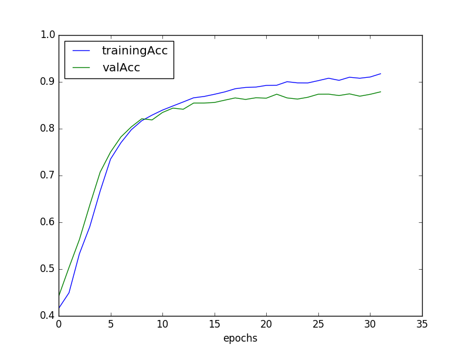

2) GRIDcorpus without mouth alignment and with mean subtraction : 2-SimpleSeq2Seq-h256-depth2-Adam-5e-04-GRIDcorpus-s0107-s0909-meanSub-tMouth-vMouth-epoch066-tl0.1344-ta0.9269-vl0.3941-va0.8688

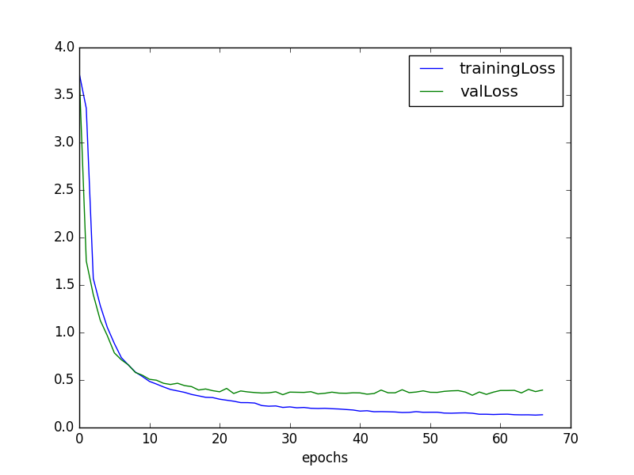

3) GRIDcorpus with mouth alignment and with mean subtraction : 7-SimpleSeq2Seq-h256-depth2-Adam-5e-04-GRIDcorpus-s0107-s0909-NOmeanSub-tAlign-vAlign-epoch044-tl0.1238-ta0.9002-vl0.3443-va0.8547

4) GRIDcorpus without mouth alignment and with mean subtraction : 6-SimpleSeq2Seq-h256-depth2-Adam-5e-04-GRIDcorpus-s0107-s0909-NOmeanSub-tMouth-vMouth-epoch045-tl0.1856-ta0.8806-vl0.4035-va0.8271.hdf5

### Experiments with Critic

- Used Conv3D, with Slow fusion for video (14 frames per word)
- Concatenated word as 1 feature, to x-dimensional video feature

1) 5-C3DCritic-l1f4-l2f4-l3f8-fc1n8-vid8-oHn16-Adam-1e-04-GRIDcorpus-s0107-s0909-meanSub-tMouth-vMouth

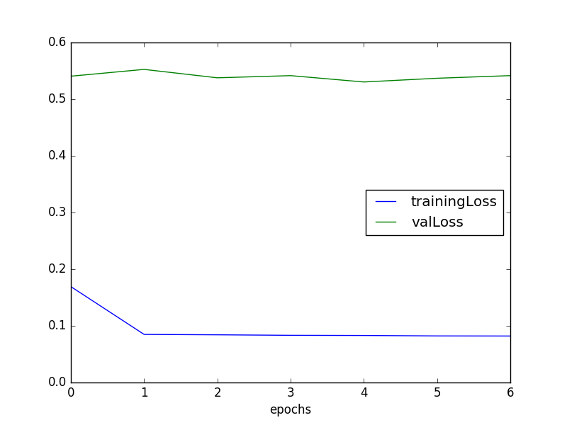

2) 8-C3DCritic-l1f4-l2f4-l3f4-fc1n4-vid4-oHn4-Adam-1e-04-GRIDcorpus-s0107-s0909-NOmeanSub-tAlign-vAlign

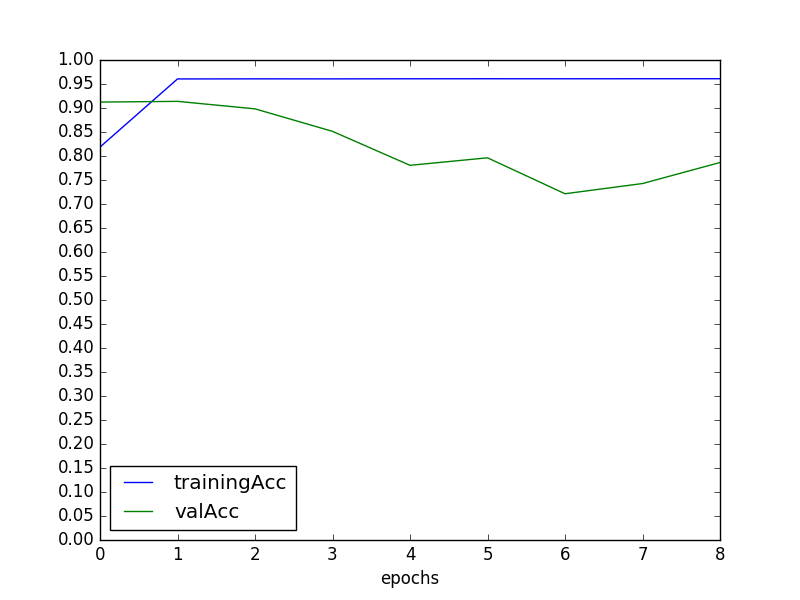

### WRONG Experiments

- Spent lot of time taking input erroneously

1) Example of wrong dataset input (conducted 21 experiments with varying model)

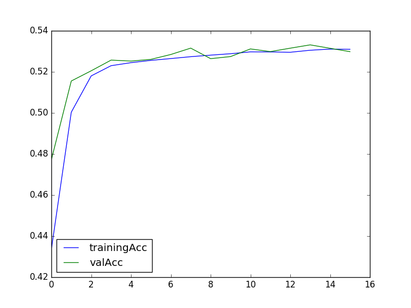
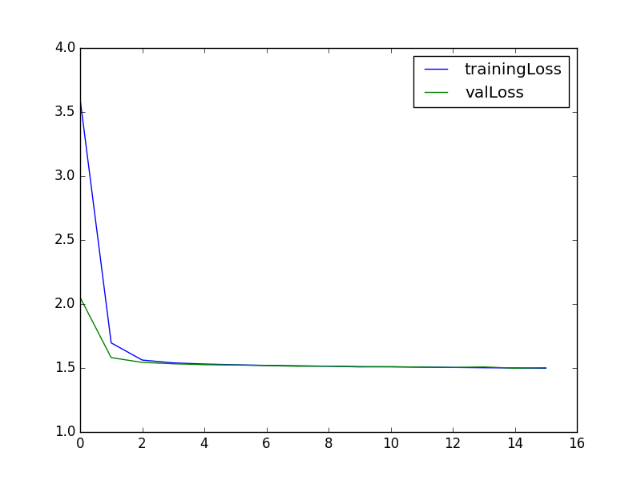

---

## 2017-07-08

### Discussion

- Check if pose is a good addition

- RNN-evaluator = actor-critic, RNN chooses, critic says if you chose wrong
    - RNN with actor-critic: Towards diverse and natural image descriptions via conditional Gan - to evaluate captions - Raquel 

- RNN - beam search
    - Dhruv - Diverse Beam Search (on arxiv, not published). But not with structured loss

---

## 2017-07-01

### Completed

- Got permission for LRW dataset

- Require ~2TB of storage for TV shows, etc.

- Theory of LSTMs

- Read [LIPREADING WITH LONG SHORT-TERM MEMORY](https://arxiv.org/pdf/1601.08188.pdf) (Michael Wand)

- Coded preprocessing steps in full to extract 40x40 mouth
    - Multiple (erroneous) faces detection (took the one with max width)
    - Non-mouth area erroneously detected as mouth (constrained face area in which to detect mouth)

Frame extracted from video: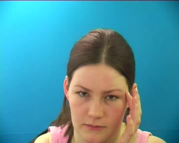

Face extracted from Frame: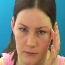

Mouth extracted from Face: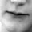

- Computed face pose (yaw, pitch, roll) using [gazr](https://github.com/severin-lemaignan/gazr)

Above Head pose: (0.018895, 0.0636381, 0.65107)

- Extracted Facial Landmarks and aligned face using [imutils](https://github.com/jrosebr1/imutils) (python)

Aligned Face extracted from Frame:

Aligned Mouth extracted from Aligned Face: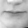

### Discussion

- Face Alignment?

- One-to-one LSTM?

### TO DO

- Compare with Abhishek's face images

- Compare Pose estimation papers (talk to Isha)

- Read [Spatial Transformer Networks](https://arxiv.org/pdf/1506.02025.pdf) (Zisserman)

- Run LSTM on GRIDcorpus (copying all files into Atom is time-consuming)

- Run network on LRW

### MISC

- Nose/mouth fiducials

- [Nearest Neighbor based Collection OCR](https://researchweb.iiit.ac.in/~pramod_sankar/papers/Pramod10Nearest.pdf)

---

## 2017-06-24

### Completed

- Read papers:
    - [Deep Learning of Mouth Shapes for Sign Language](http://www.cv-foundation.org/openaccess/content_iccv_2015_workshops/w12/papers/Koller_Deep_Learning_of_ICCV_2015_paper.pdf)
    - TIMIT Database - [39 (folded) phones](https://www.intechopen.com/books/speech-technologies/phoneme-recognition-on-the-timit-database) (Table 3); http://laotzu.bit.uni-bonn.de/ipec_presentation/speaker0.pdf] + 1 garbage
    - [Clustering Persian viseme using phoneme subspace for developing visual speech application](https://link.springer.com/content/pdf/10.1007%2Fs11042-012-1128-7.pdf) (need IIIT server)
    - [AN IMPROVED AUTOMATIC LIPREADING SYSTEM TO ENHANCE SPEECH RECOGNITION - E. Petajan](http://delivery.acm.org/10.1145/60000/57170/p19-petajan.pdf?ip=14.139.82.6&id=57170&acc=ACTIVE%20SERVICE&key=045416EF4DDA69D9%2E1E2B3508530718A8%2E4D4702B0C3E38B35%2E4D4702B0C3E38B35&CFID=941095463&CFTOKEN=15453391&__acm__=1498134384_9aaadfc1a2b78e0006e00d48dd5d00b9) (need IIIT server)
    - [You said that? - Zisserman](https://arxiv.org/pdf/1705.02966.pdf), [video](https://www.youtube.com/watch?v=lXhkxjSJ6p8&feature=youtu.be)
    - [Going deeper with convolutions](https://arxiv.org/pdf/1409.4842.pdf)
    - [Rethinking the Inception Architecture for Computer Vision](https://arxiv.org/pdf/1512.00567.pdf)
    - [Keras implementation](https://github.com/fchollet/deep-learning-models)

- Found other datasets online
    - [GRIDcorpus](http://spandh.dcs.shef.ac.uk/gridcorpus/)
    - [LILiR (Language-Independent Lip Reading)](http://www.ee.surrey.ac.uk/Projects/LILiR/datasets.html)
    - [RWTH-PHOENIXWeathercorpus](https://www-i6.informatik.rwth-aachen.de/~forster/database-rwth-phoenix.php)
    - LipNet - "Lipreading datasets (AVICar, AVLetters, AVLetters2, BBC TV, CUAVE, OuluVS1, OuluVS2) are plentiful (Zhou et al., 2014; Chung & Zisserman, 2016a), but most only contain single words or are too small. One exception is the GRID corpus (Cooke et al., 2006)"

### Discussion

- "Deep Learning of Mouth Shapes for Sign Language" trained mouth shapes without the need of mouth features (mouth landmarks, SICAAM, etc.) and achieved better accuracy

- "LipNet" said "Lipreading with LSTM" and "Lip Reading Sentences in the Wild" are end-to-end trainable

- LipNet (Nando de Freitas) achieves better accuracy than both, without mouth features or visemes

- Do we want to improve LipNet instead?

- "You said that?" (Zisserman) does one-shot learning to generate lip movement on face image live

### TO DO

- Size of dataset

- Pose estimation

---

## 2017-06-17

### Completed

- Acquired videos and subtitles for:

Sl   | Name                 | Hours |    Words | Accent
----:|:-------------------- | ----:| ---------:|:-----
1 | Arrested Development    |   25 |   270593 | American
2 | Big Bang Theory         |   81 |   600410 | American
3 | Blackadder              |   11 |    89264 | British
4 | Black Mirror            |    5 |    28726 | British
5 | Breaking bad            |   48 |   208152 | American
6 | Community               |   38 |   332828 | American
7 | Coupling                |   14 |    89559 | British
8 | Daredevil               |   26 |   118013 | American
9 | Dexter                  |   96 |   480590 | American
10 | Doctor Who             |   98 |   652497 | British
11 | F.R.I.E.N.D.S          |   78 |   567046 | American
12 | Game of Thrones        |   60 |   261992 | British
13 | House M.D.             |  130 |   876822 | American
14 | House of Cards         |   51 |   283397 | American
15 | How I Met Your Mother  |   72 |   599478 | American
16 | Jeeves & Wooster       |   20 |   115564 | British
17 | Modern Family          |   70 |   681871 | American
18 | Sherlock Holmes (old)  |   37 |   196394 | British
19 | Suits                  |   64 |   283397 | American
20 | Two And Half Men       |   86 |   625624 | American

    Total number of hours collected: 1110  
    Total number of words in subtitles: ~7,362,000

- Read papers and watched videos on Weak Supervision
    - [003. Learning Object Detectors From Weakly Supervised Image Data - Kate Saenko](https://www.youtube.com/watch?v=HzwpHf7O8IA)
    - [Weakly-Supervised Deep Learning for Customer Review Sentiment Classification](https://www.ijcai.org/Proceedings/16/Papers/523.pdf)
    - [WELDON: Weakly Supervised Learning of Deep Convolutional Neural Networks](http://www.cv-foundation.org/openaccess/content_cvpr_2016/papers/Durand_WELDON_Weakly_Supervised_CVPR_2016_paper.pdf)
    - [Read My Lips: Continuous Signer Independent Weakly Supervised Viseme Recognition](https://pdfs.semanticscholar.org/8db1/cb761adb114fb0e1c722dff3179c496dc760.pdf?_ga=2.43365861.1570143410.1497644619-1496838668.1497644619)
    - [Deep Learning of Mouth Shapes for Sign Language](http://www.cv-foundation.org/openaccess/content_iccv_2015_workshops/w12/papers/Koller_Deep_Learning_of_ICCV_2015_paper.pdf)

### Discussion

- Workflow:
    1. Subtitle -> Viseme (CNN?)  
    2. Detect face(s) -> Detect mouth (SICAAM) landmarks -> CNN -> Viseme  
    3. Viseme -> Subtitle (HMM? RNN?)  

- Weak supervision in the problem?

- Kyunyun Cho - end-to-end alignment & translation: [NEURAL MACHINE TRANSLATION BY JOINTLY LEARNING TO ALIGN AND TRANSLATE](https://arxiv.org/pdf/1409.0473.pdf)

- Mouth pose - use as an additional feature on Abhishek's problem

### To be done

- To acquire more data?
- To figure out Weak Supervision (by reading papers)

- To read:
    - [Learning weakly supervised multimodal phoneme embeddings](https://arxiv.org/pdf/1704.06913.pdf)
    - [Constrained Convolutional Neural Networks for Weakly Supervised Segmentation](https://arxiv.org/pdf/1506.03648.pdf)
    - [Combining Residual Networks with LSTMs for Lipreading](https://arxiv.org/pdf/1703.04105.pdf)

---

## 2017-06-10

### Completed

- Acquired videos and subtitles for:

Sl   | Name                 | Hours |    Words | Accent
----:|:-------------------- | ----:| ---------:|:-----
1 | Arrested Development    |   25 |   270593 | American
2 | Big Bang Theory         |   81 |   600410 | American
3 | Blackadder              |   11 |    89264 | British
4 | Black Mirror            |    5 |    28726 | British
5 | Breaking bad            |   48 |   208152 | American
6 | Community               |   38 |   332828 | American
7 | Coupling                |   14 |    89559 | British
8 | Daredevil               |   26 |   118013 | American
9 | Dexter                  |   96 |   480590 | American
10 | Doctor Who             |   98 |   652497 | British
11 | F.R.I.E.N.D.S          |   78 |   567046 | American
12 | House M.D.             |  130 |   876822 | American
13 | How I Met Your Mother  |   72 |   599478 | American
14 | Jeeves & Wooster       |   20 |   115564 | British
15 | Modern Family          |   70 |   681871 | American
16 | Sherlock Holmes (old)  |   37 |   196394 | British

Total number of hours collected: 849

Total number of words in subtitles: ~5,907,000

Target number of hours = More than 1000

- Read papers and watched videos on Weak Supervision
    - [Learning to Segment Under Various Forms of Weak Supervision](https://www.cs.toronto.edu/~urtasun/publications/xu_etal_cvpr15.pdf)
    - [Presentation: Deep learning and weak supervision for image classification](http://thoth.inrialpes.fr/workshop/thoth2016/slides/cord.pdf)
    - [Hannaneh Hajishirzi - Learning with Weak Supervision](https://www.youtube.com/watch?v=XcFM9tMjePw)
    - [Learning Object Detectors From Weakly Supervised Image Data - Kate Saenko](https://www.youtube.com/watch?v=HzwpHf7O8IA)

### To be done

- To acquire more data - at least 1000 hours

- To figure out Weak Supervision (by reading papers)

- To read:
    - [Constrained Convolutional Neural Networks for Weakly Supervised Segmentation](https://arxiv.org/pdf/1506.03648.pdf)
    - [Combining Residual Networks with LSTMs for Lipreading](https://arxiv.org/pdf/1703.04105.pdf)
    - [WELDON: Weakly Supervised Learning of Deep Convolutional Neural Networks](http://www.cv-foundation.org/openaccess/content_cvpr_2016/papers/Durand_WELDON_Weakly_Supervised_CVPR_2016_paper.pdf)
    - [Weakly-Supervised Deep Learning for Customer Review Sentiment Classification](https://www.ijcai.org/Proceedings/16/Papers/523.pdf)
    - [Neural Ranking Models with Weak Supervision](https://arxiv.org/pdf/1704.08803.pdf)

---

## PREVIOUSLY READ

### Lip Reading
- [Lip Reading in the Wild](https://www.robots.ox.ac.uk/~vgg/publications/2016/Chung16/chung16.pdf)
- [Lip Reading Sentences in the Wild](https://arxiv.org/pdf/1611.05358.pdf)

### Weak Supervision
- [Weakly-Supervised Alignment of Video With Text](https://arxiv.org/pdf/1505.06027.pdf)

### Others
- [The Unreasonable Effectiveness of Recurrent Neural Networks](http://karpathy.github.io/2015/05/21/rnn-effectiveness/)
- [IIIT Summer school 2016 Lab](http://preon.iiit.ac.in/summerschool/lab3.html)
